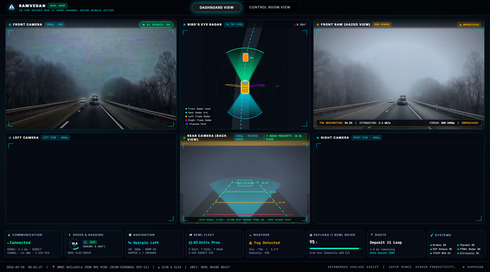
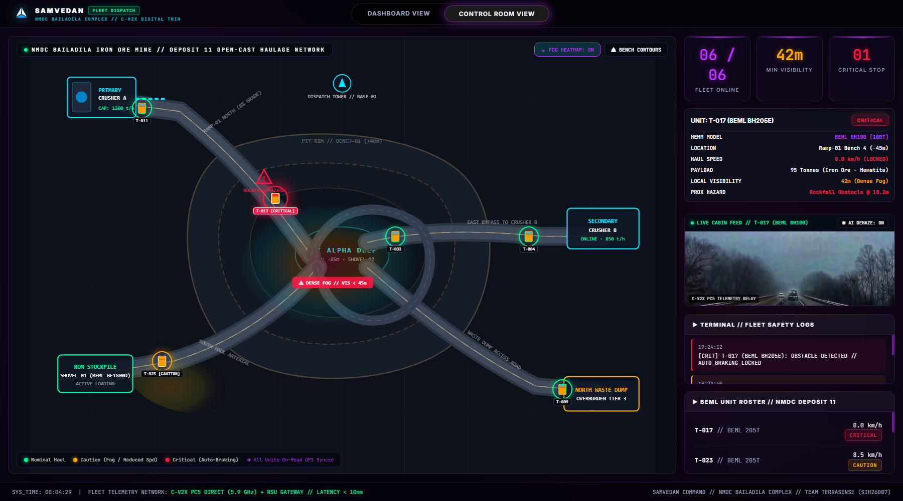

# SAMVEDAN (संवेदन)
### Safety Aware Mine Vehicle sensing Enhanced Detection and Navigation
**Autonomous Haulage Assist & Fail-Safe Braking System for Open-Cast Mining HEMM**

[](#)
[%20Dehazer-00fa9a.svg)](#)
[](#)
[-38bdf8.svg)](#)
[-ff4444.svg)](#)
[](#)

---

## 1. Project Overview

| Metric | Project Specification |
| :--- | :--- |
| **System Name** | **SAMVEDAN** (Safety Aware Mine Vehicle sensing Enhanced Detection and Navigation) |
| **Problem Statement ID** | **SIH26007** |
| **Problem Title** | *Safe and Efficient Operation of Mine Vehicles in Fog and Low-Visibility Conditions in Open Cast Iron Ore Mines* |
| **Team Name / ID** | **TerraSense** (Team ID: 146909) |
| **Primary Target Mine** | **NMDC Limited — Bailadila Iron Ore Mine** (BIOM-Kirandul Complex & BIOM-Bacheli Complex, Dantewada, Chhattisgarh) & Donimalai Complex |
| **Operating Conditions** | Heavy monsoonal fog (June–October), ridge altitude ~1,200m MSL, visibility drops to 3–5 meters, high quarry dust, slurry spray |
| **Primary Vehicle Target** | Indigenous Heavy Earth Moving Machinery (**BEML BH100** 100-tonne & **BEML BH205E** 205-tonne Dump Trucks) |
| **Strategic Objective** | Eliminate seasonal low-visibility haulage stoppages, prevent blind-spot collisions, and protect operational uptime toward NMDC's **100 MT 2030 Production Target** |

---

## 2. Executive Summary

Heavy open-cast iron ore mining operations—such as NMDC Bailadila—face severe production interruptions and heightened collision hazards during the monsoon season. Dense mountain fog rolls across hilltop haul roads, collapsing ambient visibility down to 3–5 meters. When unassisted haul trucks encounter near-zero visibility, mines are forced to halt haulage cycles, creating multi-crore production losses and risking fatal collisions with light utility vehicles, road berms, or extraction bench drop-offs.

Rather than requiring full vehicle autonomy—an expensive, high-risk transition with long lead times—**SAMVEDAN** is engineered as a **retrofittable, mine-hardened driver-assistance and fail-safe braking platform**. 

The system combines multi-spectral perception (thermal LWIR imaging, 77GHz mmWave radar, ultrasonic arrays, and RTK-GNSS+IMU) with physics-based Dark Channel Prior (DCP) optical dehazing and deep Bird's-Eye-View (BEVFusion) sensor fusion. It delivers real-time situational awareness to the in-cab operator via a ruggedized tactical HUD while transmitting live spatial telemetry to the mine control room via direct C-V2X PC5 communications.

---

## 3. How It Works: The 5-Stage System Pipeline

```
  ┌────────────────────────────────────────────────────────────────────────────────────────┐
  │                                1. MULTI-SPECTRAL SENSING                               │
  │   1080p HDR Optical  │  FLIR LWIR Thermal  │  77GHz mmWave Radar  │  Ultrasonic Array  │
  └───────────────────────────────────────────┬────────────────────────────────────────────┘
                                              │
  ┌───────────────────────────────────────────▼────────────────────────────────────────────┐
  │                               2. FUSE & RESTORE (DEHAZE)                               │
  │   Dark Channel Prior (DCP) Atmospheric Light Estimation  → Real-Time Optical Dehazing   │
  │   Lift-Splat-Shoot (LSS) Feature Lifting  →  BEVFusion Confidence-Weighted Hazard Map  │
  └───────────────────────────────────────────┬────────────────────────────────────────────┘
                                              │
  ┌───────────────────────────────────────────▼────────────────────────────────────────────┐
  │                                  3. TIERED RISK DECISION                               │
  │   Dynamic Time-To-Collision (TTC) Engine:  NORMAL  →  CAUTION  →  ALERT  →  CRITICAL   │
  │   Proactive Computer Vision Ditch & Road Berm Edge Analysis (Drop-off Detection)       │
  └─────────────────────┬───────────────────────────────────────────────────┬──────────────┘
                        │                                                   │
  ┌─────────────────────▼──────────────────────────────┐   ┌────────────────▼──────────────┐
  │                 4. ALERT & ACT                     │   │        5. COMMUNICATE         │
  │  • Tactical In-Cab Driver HUD (Line-of-Sight)      │   │  • Zero-Cellular V2V Mesh     │
  │  • Fail-Safe Autonomous Emergency Braking (AEB)    │   │    (C-V2X PC5 / SAE J2735)    │
  │  • Hardware Bypass: Ultrasonic Direct-to-MCU       │   │  • Roadside Unit (RSU) Relay  │
  │    (Infineon AURIX TC397 targeting ASIL-D)         │   │  • Central Control Room Twin  │
  └────────────────────────────────────────────────────┘   └───────────────────────────────┘
```

### 1. Sense (Multi-Spectral Sensing)
- **Optical & Thermal Imaging:** Forward, rear, and flank 1080p HDR optical cameras paired with Long-Wave Infrared (LWIR) thermal cameras detect heat signatures of vehicles and personnel, maintaining target contrast even when visible optical contrast completely collapses in dense fog.
- **77GHz mmWave Radar:** Emits high-frequency electromagnetic radar waves that penetrate fog, dust, and water droplets unimpeded, measuring target distance, range rate, and relative velocity.
- **Ultrasonic Proximity Array:** 16 waterproof transducers mounted along the truck chassis provide sub-meter precision obstacle proximity sweeps.
- **Dual-Band RTK-GNSS + 6-DOF IMU:** Provides centimeter-level vehicle localization along high-altitude winding quarry benches, retaining trajectory tracking through momentary satellite shading.

### 2. Fuse and Dehaze (Perception Restoration)
- **Dark Channel Prior (DCP) Optical Dehazing:** Estimates real-time atmospheric attenuation and haze thickness directly from the video stream using the physical model of atmospheric scattering:
  $$\mathbf{I}(x) = \mathbf{J}(x) \cdot t(x) + \mathbf{A}(1 - t(x))$$
  Where $\mathbf{I}(x)$ is the observed hazy frame, $\mathbf{J}(x)$ is the restored clear scene radiance, $\mathbf{A}$ is atmospheric light, and $t(x)$ is transmission depth. This significantly extends driver visibility and cleans input frames for downstream machine learning.
- **Bird's-Eye-View (BEVFusion):** A convolutional feature extractor lifts multi-camera and radar inputs into a shared top-down coordinate frame (Lift-Splat-Shoot + BEVFusion), outputting a single, confidence-weighted spatial hazard map instead of multiple disconnected feeds.

### 3. Decide (Risk Engine & Berm Edge Tracking)
- **Tiered Threat Classification:** Continuously monitors relative velocity and Time-To-Collision (TTC), categorizing risks into four deterministic tiers:
  $$\text{NORMAL} \longrightarrow \text{CAUTION} \longrightarrow \text{ALERT} \longrightarrow \text{CRITICAL}$$
- **Proactive Road & Ditch Analysis:** Specialized edge-detection computer vision algorithms trace road berm boundaries and ditch drop-offs, alerting the operator to dangerous shoulder drift before the vehicle leaves the safe haul road surface.

### 4. Alert and Act (Genuine Fail-Safe Architecture)
- **Dashboard-Native Early Warnings:** Early visual and acoustic alerts are rendered directly in the driver's forward line of sight, providing critical reaction time ahead of human visual detection.
- **Hardware-Level Safety Interlock:** If the AI perception stack experiences processing delays or an edge-compute stall, the system automatically falls back to an independent, non-ML ultrasonic safety layer. This circuit is wired directly into a dedicated automotive safety microcontroller (**Infineon AURIX TC397**, targeting **ASIL-D** functional safety) which triggers autonomous emergency braking (AEB) directly on the vehicle pneumatic/hydraulic brake line, ensuring the vehicle never loses its fail-safe protection.

### 5. Communicate (Zero-Cellular Dependency)
- **C-V2X PC5 Direct Mode (5.9 GHz / SAE J2735):** Broadcasts truck kinematics, hazard locations, and fog density metrics directly between trucks without requiring cellular towers or cloud connectivity. This is critical for remote mountain valley sections with zero coverage.
- **Roadside Units (RSUs) & V2I:** Stationary solar-powered RSU gateways positioned along quarry ramps relay hazard and vehicle data to the central dispatch room, driving a real-time digital twin of the mine network.

---

## 4. Key Innovations & Differentiators

1. **Genuine Fail-Safe Architecture:** Dual-layer design ensures braking execution even if the edge AI pipeline suffers an operating system stall or inference latency timeout.
2. **Zero-Network-Dependency V2V:** C-V2X PC5 direct communication ensures peer-to-peer truck telemetry across remote, shadowed mountain benches without cellular infrastructure.
3. **Modular Retrofit Compatibility:** Designed to mount directly on existing HEMM platforms (BEML BH100, BH205E, BH85) without requiring chassis redesign or hydraulic overhaul.
4. **Mine-Hardened Environmental Resilience:** High-pressure washer-jet nozzle lens cleaners, heated anti-condensation sensor enclosures, and MIL-STD-810H vibration-damped mounts withstand heavy dust, mud, and continuous vibration.
5. **Proactive Berm & Road Edge Hazard Detection:** Detects road-edge degradation, washouts, and bench drop-offs rather than tracking moving obstacles alone.
6. **Unified Digital Twin Platform:** Integrates vehicle-level fog safety, spatial hazard mapping, and fleet dispatch into a single synchronized command ecosystem.

---

## 5. System Software Architecture & Interfaces

The codebase provides two synchronized operational interfaces:

```
dashboard-and-crt-room/
│
├── index.html                  # In-Cab Driver Tactical HUD Interface
├── control-room.html           # Central Fleet Dispatch & Command Digital Twin
├── config.js                   # Vehicle Telemetry & Fleet Configuration
├── style.css                   # High-Contrast Cybernetic Industrial Dark Design System
├── script.js                   # Unified Telemetry Engine & Interactive Controller
│
├── assets/                     # System Branding & Interface Screenshots
│   ├── logo.png                # Official SAMVEDAN 3D Delta Brand Mark
│   ├── driver_hud_dashboard.png # In-Cab Driver Tactical HUD Screenshot
│   ├── control_room_dashboard.png # Fleet Command Center Screenshot
│   └── samvedan-logo.svg       # Vector Graphic Source
│
├── videos/                     # High-Definition Camera Sensor Streams
│   ├── front camers dehaze.mp4 # Real-Time DCP AI Dehazed Restored Optical Stream
│   └── front camers haze.mp4   # Raw Unprocessed Heavy-Fog Optical Camera Stream
│
└── README.md                   # Complete Enterprise Product Documentation
```

### A. Driver In-Cab Tactical HUD (`index.html`)



- **Front Camera Optical Stream:** Features real-time toggling between the raw hazed camera stream and the Dark Channel Prior (DCP) AI-dehazed restored stream.
- **3D Bird's-Eye-View (BEV) Radar Scanner:** 360° fused obstacle representation showing forward radar cones, lateral blind-spot sweeps, planned trajectory vectors, and leading truck relative distance (38m).
- **Rear Proximity Radar & Camera:** Real-time reversing distance grid (5m, 10m, 15m, 20m thresholds) with 77GHz blind-spot sensor clearance telemetry.
- **Flank Catwalk Monitors:** Dedicated left and right camera channels for bench clearance.
- **8 Live Telemetry Cards:** C-V2X Direct Communication status, Speedometer & Heading gauge, Turn Navigation, Fleet Proximity, Atmospheric Fog/Humidity sensors, Payload tonnage (BEML BH100 Hematite 65% Fe), Route progress, and Core Subsystem Health checks.
- **Fail-Safe AEB Interlock:** Visual and audio warning banner with emergency auto-braking simulation trigger (`TEST AEB INTERLOCK` / Keyboard shortcut `A`).

### B. Fleet Command Center (`control-room.html`)



- **Mine Haul Road GIS Network:** Topographical digital twin mapping benches, extraction faces, crusher hoppers, waste dumps, and active haul trucks across the NMDC Bailadila Deposit 11 complex.
- **Dynamic Fog Density Heatmap:** Real-time atmospheric fog overlay mapped across quarry elevations with live toggle controls.
- **Interactive Fleet Unit Inspector:** Click any truck node (`T-017`, `T-023`, `T-011`, `T-004`, `T-009`, `T-032`) to view real-time haul speed, location, local fog visibility, payload grade, and hazard proximity.
- **Live In-Cab Video Relay:** Remote optical telemetry stream monitor broadcasting from active haul units.
- **Fleet Safety Terminal Logs:** Live event stream recording critical auto-brake engagements, fog threshold warnings, and discharge confirmations.

---

## 6. Hardware Specifications & Bill of Materials (BOM)

The hardware architecture uses 100% commercially available, mine-proven COTS components:

| Subsystem | Component Specification | Target Placement |
| :--- | :--- | :--- |
| **Edge AI Perception Computer** | NVIDIA DRIVE Orin / Industrial Jetson AGX Orin (IP67 enclosed) | Cab Electronics Bay |
| **Safety Microcontroller** | Infineon AURIX TC397 (Triple-Core Lockstep, ASIL-D target) | Direct Brake Interlock Enclosure |
| **Optical Cameras** | 4× Automotive 1080p HDR Cameras (WDR > 120dB, Sony STARVIS) | Front Cab, Rear Bed, Left/Right Mirrors |
| **Thermal Camera** | 1× FLIR Boson LWIR Thermal Camera (320×256 / 640×512, 60Hz) | Forward Cab Roof Bar |
| **Long-Range Radar** | 1× 77GHz mmWave Automotive Radar (250m range, ±0.1 m/s velocity) | Front Radiator Grille |
| **Rear Radar** | 1× 77GHz Short-Range Radar (50m range, wide 120° FOV) | Rear Dump Bed Crossmember |
| **Proximity Ultrasonic Array**| 16× Industrial Sealed Waterproof Ultrasonic Transducers (IP68) | Perimeter Chassis Ring |
| **Positioning Engine** | Dual-Frequency RTK-GNSS Receiver + 6-DOF Automotive IMU | Cab Roof Canopy |
| **V2V Transceiver** | C-V2X PC5 On-Board Unit (OBU) 5.9 GHz + High-Gain Antennas | Vehicle Telematics Box |
| **Lens Maintenance** | Pneumatic high-pressure air/washer-jet sprayers + heated lenses | Camera Optic Housings |

### Deployment Cost Model (Per Unit Feasibility)

| Module | Scope | Estimated Cost (INR) |
| :--- | :--- | :--- |
| **Vehicle Sensor & Edge Compute Suite** | Cameras, 77GHz radar, thermal, ultrasonics, Orin edge board, TC397 MCU | ₹2,25,000 |
| **Control Room Dispatch Hardware** | Server node, dual-monitor console, digital twin GIS license | ₹1,20,000 |
| **Installation & Mine Hardening** | Custom brackets, wiring harness, pneumatic washer jets, commissioning | ₹25,000 |
| **Roadside Unit (RSU) Infrastructure** | Solar-powered 5.9 GHz radio beacon / RSU gateway (pro-rata per truck) | ₹60,000 |
| **Total Estimated Deployment Cost** | **Complete retrofitted safety system per HEMM** | **₹4,30,000 (~₹4.3 Lakhs)** |

*Compared to the cost of a single 100-tonne haul truck (₹8–12 Crores) or the losses incurred from a single shift shutdown, the ₹4.3 Lakh per-truck retrofit offers immediate ROI within the first monsoon fog season.*

---

## 7. Quickstart & Operation

1. **Clone the repository:**
   ```bash
   git clone https://github.com/<YOUR_ORGANIZATION>/samvedan-hemm-system.git
   cd samvedan-hemm-system
   ```

2. **Launch the Driver In-Cab HUD:**
   - Open [`index.html`](index.html) in Google Chrome, Microsoft Edge, or a kiosk touchscreen browser.
   - Use the **☀ AI DEHAZE: ON/OFF** button on the Front Camera panel to compare real-time DCP restoration.
   - Click any camera panel to open the full-screen enlarged **Camera Inspector Lightbox**.
   - Press the **`A`** key or click **TEST AEB INTERLOCK** to verify the fail-safe emergency auto-braking overlay.

3. **Launch the Fleet Command Center:**
   - Open [`control-room.html`](control-room.html) on a supervisor console or dispatch monitor.
   - Toggle the **🌫 FOG HEATMAP** button to inspect low-visibility zones.
   - Click any truck in the **BEML UNIT ROSTER** or on the map to inspect live telemetry and switch cabin optical streams.
   - Use the top navigation toggle to transition between Driver HUD and Control Room views.

---

## 8. Standards, Safety & Industry Compliance

- **DGMS Compliance:** Aligns with Directorate General of Mines Safety (DGMS) circulars on Audio-Visual Alarm Systems (AVAS), rear-vision camera systems, and proximity warning devices for heavy earthmoving machinery.
- **ISO 26262 (ASIL-D):** Safety interlock architecture targeting ASIL-D functional safety integrity for autonomous emergency braking actuation.
- **SAE J2735 / C-V2X:** Standardized direct vehicle-to-vehicle message dictionary for collision avoidance broadcasts.
- **Atmanirbhar Bharat / Make in India:** Custom-tailored for indigenous BEML mining equipment operating across NMDC, Coal India Limited (CIL), and major Indian open-pit mineral extraction sites.

---

*Team TerraSense (Team ID: 146909) | Smart India Hackathon 2026 | Problem Statement SIH26007*
